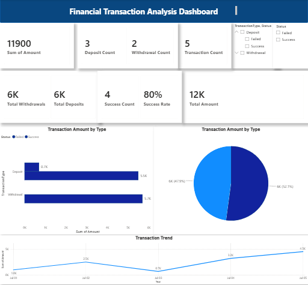

# 🏦 Financial Transaction Analysis

## 📌 Project Overview
This project analyzes financial transaction data using SQL, Python, and Power BI to generate interactive dashboards and business insights.

## 🎯 Project Objectives
- Analyze customer financial transactions.
- Track deposits and withdrawals.
- Monitor transaction success and failure rates.
- Build an interactive dashboard for decision-making.

## 🛠️ Tools & Technologies
- SQL (SQLite)
- Python (Pandas)
- Power BI
- DAX
- Git & GitHub

## 📊 Dashboard Features
- Total Transaction Amount
- Total Deposits
- Total Withdrawals
- Transaction Count
- Deposit Count
- Withdrawal Count
- Success Rate
- Interactive Filters & Slicers
- Transaction Trend Analysis
- Navigation Buttons

## 📈 Key Insights
- Compare deposits and withdrawals.
- Measure transaction success rate.
- Analyze transaction trends over time.
- Monitor transaction volume.

## 📂 Project Structure
```
Financial-Transaction-Analysis/
│── data/
│── financial_data.db
│── main.py
│── dashboard.pbix
│── README.md
```
## 📸 Dashboard Preview



## 🚀 Skills Demonstrated
- SQL Queries
- Data Cleaning with Python
- Data Modeling
- DAX Measures
- Power BI Dashboard Design
- Business Intelligence
- Data Analysis

## ▶️ How to Run

1. Clone the repository.
2. Install Python.
3. Run the Python scripts.
4. Open the Power BI (.pbix) file.
5. Explore the dashboard.

## 👨‍💻 Author
**Mohamed Waleed**

Banking Professional | Data Analyst | SQL | Python | Power BI | GitHub